# FlowDesk

**White-labeled client portal SaaS for agencies and consulting firms.**

FlowDesk gives every agency a branded online space where their clients can track project progress, approve deliverables, pay invoices, and communicate with the team — all under the agency's own brand.

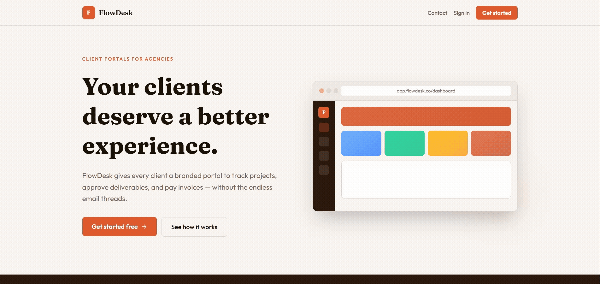

---

## Table of Contents

- [Overview](#overview)
- [Use Cases](#use-cases)
- [Features](#features)
- [Screenshots](#screenshots)
- [Architecture](#architecture)
- [Tech Stack](#tech-stack)
- [Project Structure](#project-structure)
- [Getting Started](#getting-started)
- [Environment Variables](#environment-variables)
- [Deployment](#deployment)

---

## Overview

Agencies and freelance consultants typically manage client relationships across scattered tools — project boards, email threads, shared drives, and separate invoicing software. FlowDesk consolidates all of this into a single, white-labeled portal that clients access through a branded URL (`youragency.flowdesk.io/portal/your-slug`).

The agency configures their brand (logo, primary color), invites clients, manages projects and deliverables, and sends invoices. Clients log in to a clean portal that shows only their work — no agency-internal data, no other clients' information.

---

## Use Cases

### For Agencies & Consultancies
- **Project visibility** — create projects, define milestones, track progress, and share status updates with clients in real time without sending manual reports
- **Deliverable workflows** — upload files directly to the portal; clients can approve or request revisions with notes, creating a clear audit trail
- **Invoicing** — create itemized invoices, send them to clients via email, and receive payment directly through Stripe Connect
- **Team collaboration** — invite agency members with scoped permissions; real-time chat per project keeps context in one place
- **AI-generated reports** — generate a structured project status report in one click using Gemini or a local Ollama model

### For Clients
- **Branded experience** — clients land on a portal that looks like it belongs to the agency, not a third-party tool
- **Project tracking** — see milestones, completion percentages, and deliverable status without needing access to internal tools
- **Deliverable review** — download files, approve work, or request revisions with written notes directly in the portal
- **Invoice payment** — pay outstanding invoices via Stripe's secure payment flow without leaving the portal
- **Direct messaging** — communicate with the agency team per project, with file attachment support

### Target Customers
Design agencies · Development studios · Marketing agencies · Freelance consultants · Any service business with 2–20 active clients

---

## Features

### Agency Dashboard
- Stat overview — active projects, pending invoices, total clients, pending deliverable reviews
- Project management — create, edit, and track projects with assigned clients
- Milestone tracking — ordered milestones with Pending / In Progress / Completed status
- Deliverable management — upload files to Cloudflare R2, track revision cycles, version history
- Real-time chat — per-project messaging with file attachments and read receipts via SignalR
- AI Status Reports — streaming project summaries powered by Google Gemini or Ollama

### Invoicing & Payments
- Create itemized invoices with line items, quantities, and unit prices
- Send invoices via SendGrid email with a payment link
- Stripe Connect integration — payments go directly to the agency's Stripe account
- Webhook confirmation — invoice status updates to Paid automatically on successful charge

### White-Label Branding
- Upload agency logo (stored in Cloudflare R2)
- Set brand primary color — applied across the entire client portal
- Custom portal URL slug — `/portal/your-agency-name`
- Public org endpoint — portal loads branding without requiring client authentication

### Authentication & Security
- JWT stored in httpOnly cookies (never localStorage)
- 15-minute access tokens with 7-day rotating refresh tokens
- Role-based access control — AgencyOwner, AgencyMember, Client
- EF Core global query filters enforce multi-tenancy at the database level
- Per-IP rate limiting on auth endpoints

---

## Screenshots

### Landing Page


### Authentication
| Register | Login |
|---|---|
| 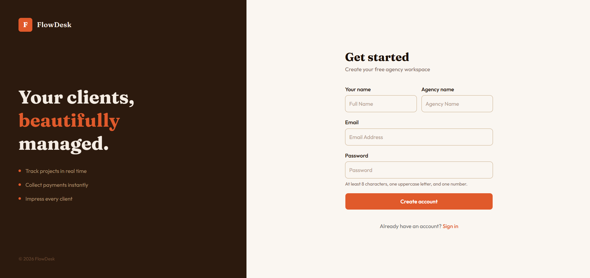 | 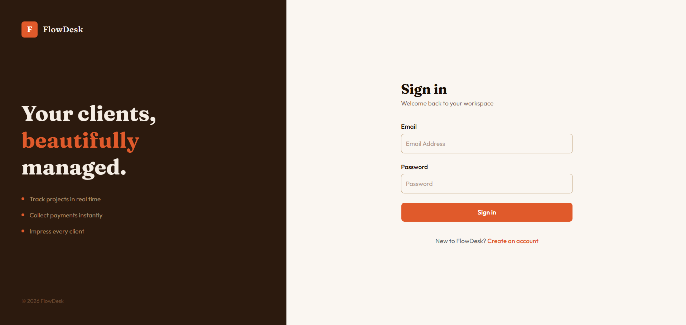 |

### Agency Dashboard
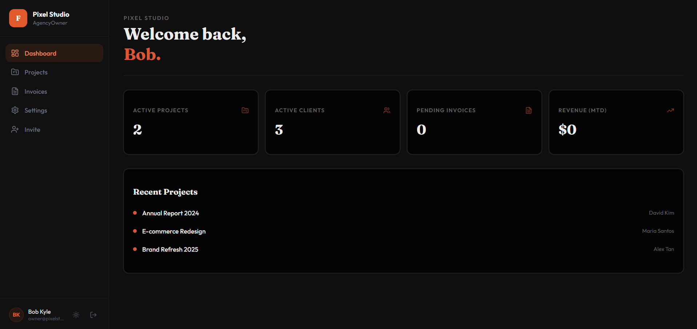

### Projects
| Projects List | Milestones |
|---|---|
| 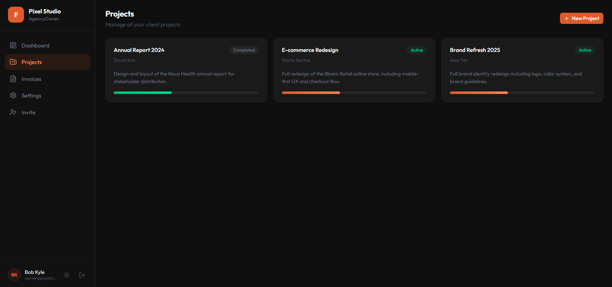 | 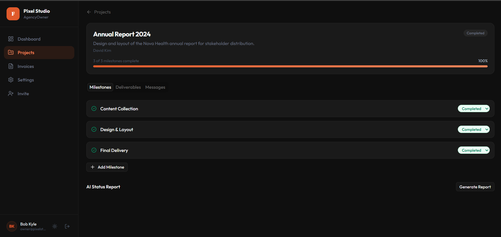 |

### Deliverables & Messages
| Deliverables | Messages |
|---|---|
| 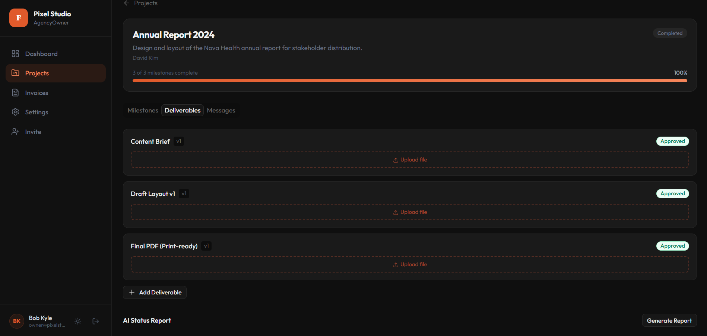 | 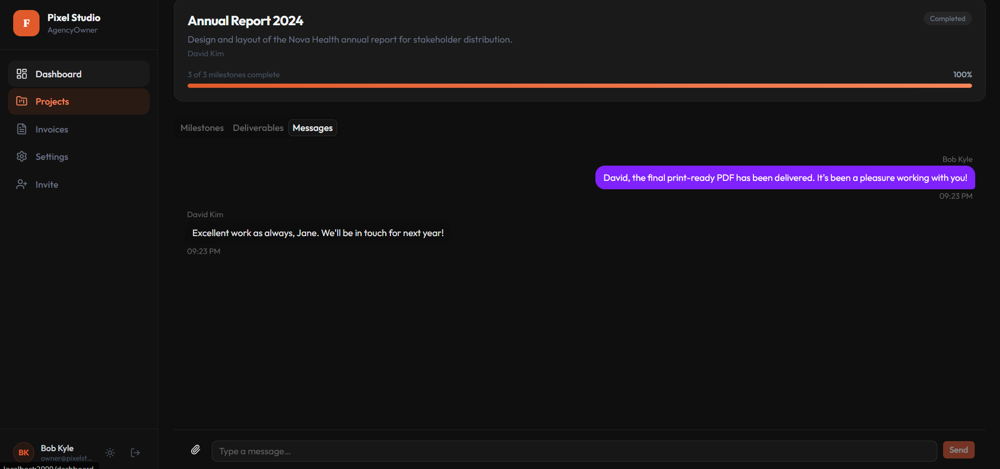 |

### AI Status Report
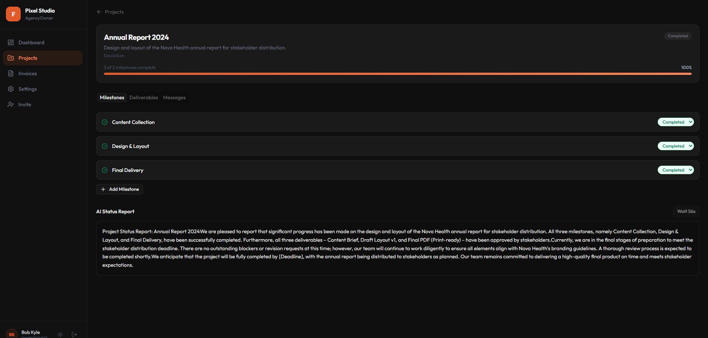

### Invoices
| Invoice List | Invoice Detail |
|---|---|
| 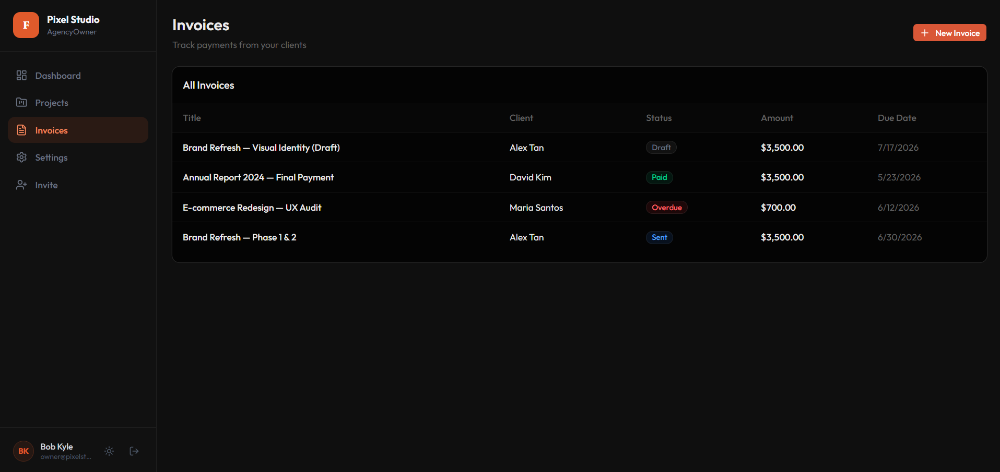 | 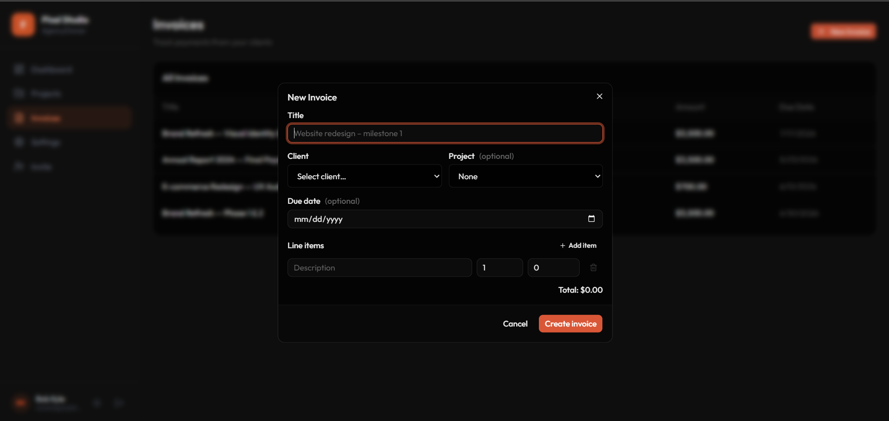 |

### Client Portal
| Client Dashboard | Project Detail |
|---|---|
| 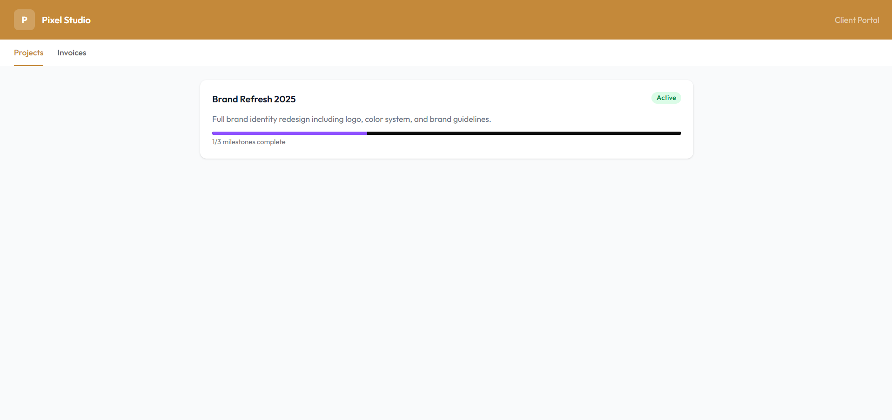 | 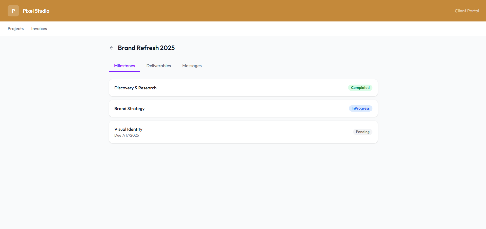 |

| Milestones View | Messages View | Invoices View |
|---|---|---|
| 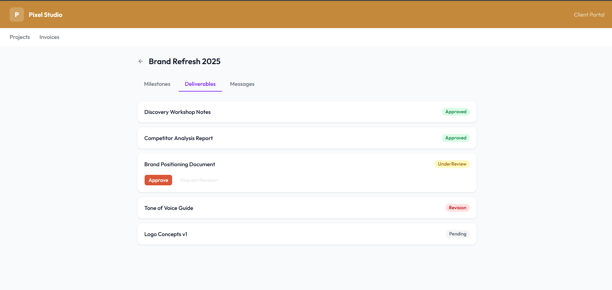 | 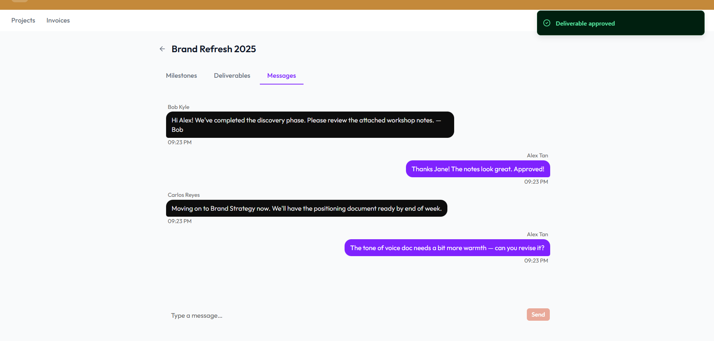 | 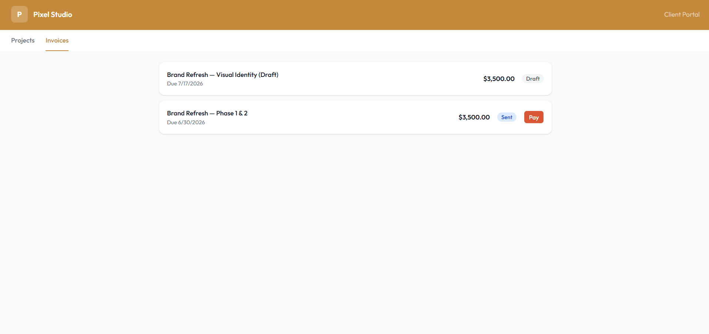 |

---

## Architecture

FlowDesk is a two-service architecture with clean separation between the API and the frontend.

```
┌─────────────────────────────────────────────┐
│                  Vercel                      │
│         Next.js 16 Frontend                  │
│  (Agency Dashboard + White-label Client      │
│   Portal — two separate layout trees)        │
└──────────────┬──────────────────────────────┘
               │  HTTPS + httpOnly cookies
               │  REST + SSE + SignalR (WSS)
┌──────────────▼──────────────────────────────┐
│                 Railway                      │
│         ASP.NET Core 8 API                   │
│  ┌──────────┐  ┌──────────┐  ┌───────────┐  │
│  │Controllers│ │  Hubs    │  │ Middleware │  │
│  │          │  │ ChatHub  │  │ Exception │  │
│  │ Auth     │  │ ProjectHub│  │ RateLimit │  │
│  │ Projects │  └──────────┘  └───────────┘  │
│  │ Invoices │  ┌──────────┐                 │
│  │ Messages │  │ Services │                 │
│  └──────────┘  │ AI/Email │                 │
│                │ Stripe   │                 │
│                └──────────┘                 │
└───┬──────────┬───────────┬──────────────────┘
    │          │           │
    ▼          ▼           ▼
  Neon      Cloudflare   Stripe / SendGrid
PostgreSQL    R2          / Gemini API
```

### Backend — Clean Architecture
```
FlowDesk.Core           → Zero infrastructure dependencies
  Entities/             → EF entity classes
  Interfaces/           → Repository + service contracts
  Services/             → Business logic (AuthService, ProjectService, etc.)
  DTOs/                 → Input/output shapes; never expose entities directly
  Enums/                → UserRole, ProjectStatus, InvoiceStatus, etc.

FlowDesk.Infrastructure → Implements Core interfaces
  Data/AppDbContext     → EF Core context with global query filters
  Repositories/         → Data access layer
  Services/             → FileStorageService (R2), AIReportService, EmailService

FlowDesk.API            → Composition root
  Controllers/          → Thin HTTP handlers
  Hubs/                 → ChatHub, ProjectHub (SignalR)
  Middleware/           → Global exception handler → ProblemDetails (RFC 7807)
  Validators/           → FluentValidation validators per DTO
  Program.cs            → Single composition root; all DI registration here
```

### Frontend — Next.js App Router
Two separate layout trees handle different user roles:

- `(auth)/` — Login and registration pages
- `(dashboard)/` — Agency-only views behind `AgencyOnly` policy
- `(client)/portal/[slug]/` — Client portal, branded per organisation

**Key patterns:**
- Auth state managed in `AuthContext`; never stored in localStorage
- All server state in `lib/queries.ts` as TanStack Query hooks
- Axios interceptor silently refreshes access tokens on 401
- `proxy.ts` (Next.js 16 middleware) enforces auth at the edge
- SignalR connections managed in `useChatHub` and `useProjectHub` hooks

### Multi-Tenancy
Every entity that belongs to an organisation (`Projects`, `Invoices`, `Messages`, `Users`) has a global EF Core query filter keyed on `OrganisationId`. This is read from the JWT claim via `ICurrentUserService`, injected into `AppDbContext`. Cross-tenant data access is structurally impossible without explicitly calling `.IgnoreQueryFilters()`.

### Real-Time
- **ChatHub** — per-project group rooms for message delivery and read receipts
- **ProjectHub** — server pushes milestone/deliverable updates; frontend invalidates TanStack Query caches on receipt
- SignalR authenticates via JWT query string on WebSocket upgrade (cookie unavailable cross-origin during WS handshake)

---

## Tech Stack

### Backend

| Category | Technology | Version |
|---|---|---|
| Runtime | ASP.NET Core | 8.0 |
| Language | C# | 12 |
| ORM | Entity Framework Core | 8.0 |
| Database | PostgreSQL (Neon) | 16 |
| Auth | JWT Bearer (httpOnly cookies) | — |
| Password hashing | BCrypt.Net-Next | 4.2 |
| Validation | FluentValidation | 11.3 |
| Real-time | ASP.NET Core SignalR | built-in |
| Payments | Stripe.net (Connect) | 51.2 |
| Email | SendGrid | 9.29 |
| File storage | AWS SDK S3 → Cloudflare R2 | 3.x |
| AI reports | Google Gemini API / Ollama | — |
| API docs | Scalar + Swashbuckle | — |

### Frontend

| Category | Technology | Version |
|---|---|---|
| Framework | Next.js | 16.2 |
| Language | TypeScript (strict) | 5.x |
| UI | React | 19.2 |
| Styling | Tailwind CSS | 4.x |
| Components | shadcn/ui + @base-ui/react | — |
| Data fetching | TanStack Query | 5.x |
| HTTP | Axios | 1.x |
| Real-time | @microsoft/signalr | 10.x |
| Payments | @stripe/react-stripe-js | 6.x |
| Forms | React Hook Form + Zod | — |
| Animations | Framer Motion | 12.x |
| Fonts | Fraunces (headings) + Outfit (body) | — |

### Infrastructure

| Service | Provider | Purpose |
|---|---|---|
| API hosting | Railway | ASP.NET Core, auto-deploys via Nixpacks |
| Frontend hosting | Vercel | Next.js, edge network |
| Database | Neon | Serverless PostgreSQL |
| File storage | Cloudflare R2 | Deliverables, chat files, logos |
| Payments | Stripe Connect | Direct agency payouts |
| Email | SendGrid | Invites + invoice notifications |
| AI | Google Gemini / Ollama | Streaming project reports |

---

## Project Structure

```
FlowDesk/
├── FlowDesk.sln
├── FlowDesk.API/           # ASP.NET Core API
│   ├── Controllers/
│   ├── Hubs/               # ChatHub, ProjectHub
│   ├── Middleware/
│   ├── Validators/
│   └── Program.cs
├── FlowDesk.Core/          # Zero-dependency business layer
│   ├── Entities/
│   ├── Enums/
│   ├── Interfaces/
│   ├── Services/
│   └── DTOs/
├── FlowDesk.Infrastructure/ # EF Core, repositories, external services
│   ├── Data/
│   ├── Repositories/
│   └── Services/
├── flowdesk-web/           # Next.js 16 frontend
│   └── src/
│       ├── app/
│       │   ├── (auth)/     # Login, Register
│       │   ├── (dashboard)/# Agency views
│       │   └── (client)/   # Client portal
│       ├── components/
│       ├── contexts/
│       ├── hooks/
│       └── lib/
├── docker-compose.yml      # Local PostgreSQL
└── .env.example
```

---

## Getting Started

### Prerequisites

- [.NET 8 SDK](https://dotnet.microsoft.com/download)
- [Node.js 20+](https://nodejs.org/)
- [Docker Desktop](https://www.docker.com/products/docker-desktop/)

### 1. Clone the repository

```bash
git clone https://github.com/Bob-Kyle-Rosales/FlowDesk.git
cd FlowDesk
```

### 2. Set up environment variables

```bash
cp .env.example .env
```

Fill in the required values in `.env` (see [Environment Variables](#environment-variables)).

### 3. Start the local database

```bash
docker compose up -d
```

### 4. Apply database migrations

```bash
dotnet ef database update \
  --project FlowDesk.Infrastructure/FlowDesk.Infrastructure.csproj \
  --startup-project FlowDesk.API/FlowDesk.API.csproj
```

### 5. Run the API

```bash
cd FlowDesk.API
dotnet run
# API available at http://localhost:5269
# Scalar docs at http://localhost:5269/scalar
```

### 6. Run the frontend

```bash
cd flowdesk-web
npm install
npm run dev
# App available at http://localhost:3000
```

---

## Environment Variables

### API (`.env` at repo root)

```env
# Database
DATABASE_URL=Host=localhost;Port=5433;Database=flowdesk;Username=flowdesk;Password=flowdesk

# Auth
JWT_SECRET=           # openssl rand -base64 64
FRONTEND_URL=http://localhost:3000

# AI (choose one provider)
AI_PROVIDER=gemini    # or: ollama
GEMINI_API_KEY=
GEMINI_MODEL=gemini-2.5-flash
OLLAMA_BASE_URL=http://localhost:11434
OLLAMA_MODEL=llama3.2

# Stripe
STRIPE_SECRET_KEY=
STRIPE_WEBHOOK_SECRET=

# SendGrid
SENDGRID_API_KEY=
SENDGRID_FROM_EMAIL=

# Cloudflare R2
CLOUDFLARE_R2_ACCESS_KEY=
CLOUDFLARE_R2_SECRET_KEY=
CLOUDFLARE_R2_BUCKET=
CLOUDFLARE_R2_ENDPOINT=
CLOUDFLARE_R2_PUBLIC_URL=
```

### Frontend (`flowdesk-web/.env.local`)

```env
NEXT_PUBLIC_API_URL=http://localhost:5269
NEXT_PUBLIC_SIGNALR_URL=http://localhost:5269
NEXT_PUBLIC_STRIPE_PUBLISHABLE_KEY=
```

---

## Deployment

### API — Railway

The API deploys automatically on push to `master`. Railway uses Nixpacks to detect the .NET project — no Dockerfile needed. Set all environment variables from the table above in the Railway dashboard.

The `railway.toml` at the repo root configures the build.

### Frontend — Vercel

The frontend deploys automatically on push. `vercel.json` at the repo root points Vercel to the `flowdesk-web/` subdirectory.

Set `NEXT_PUBLIC_API_URL` to your Railway API URL in the Vercel environment variables dashboard.

### Database — Neon

Create a Neon project and use the connection string as `DATABASE_URL` in Railway. Neon requires `sslmode=require` on the connection string for production.

---

## License

MIT
