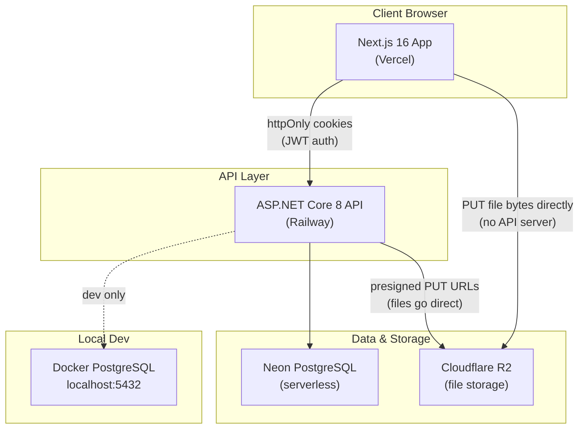
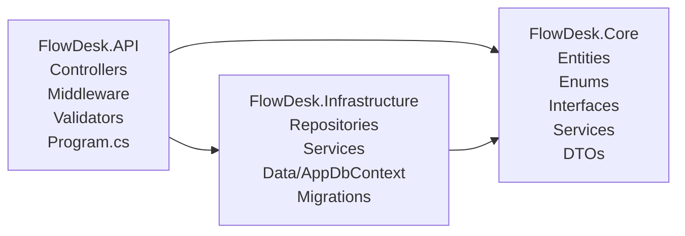
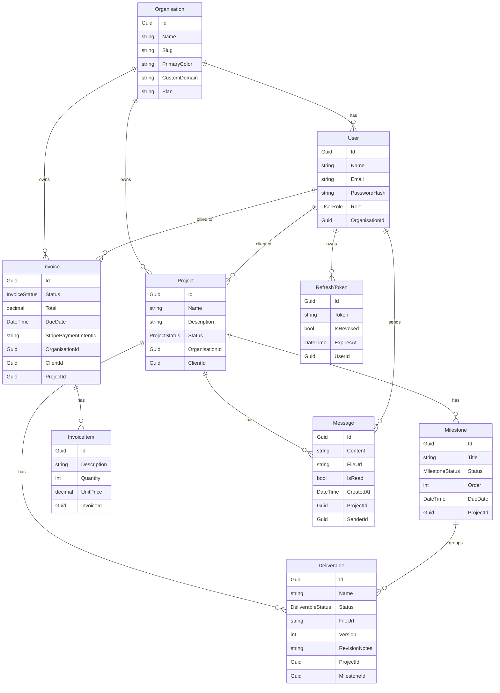
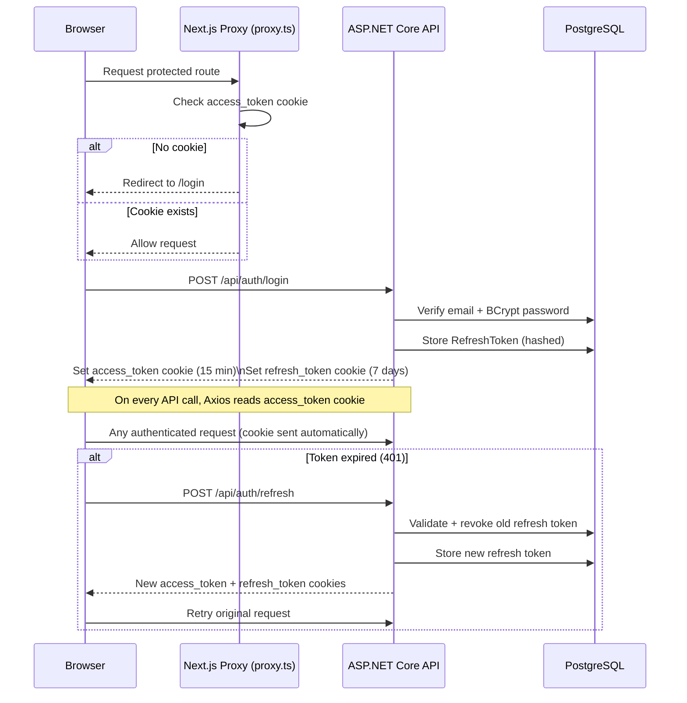
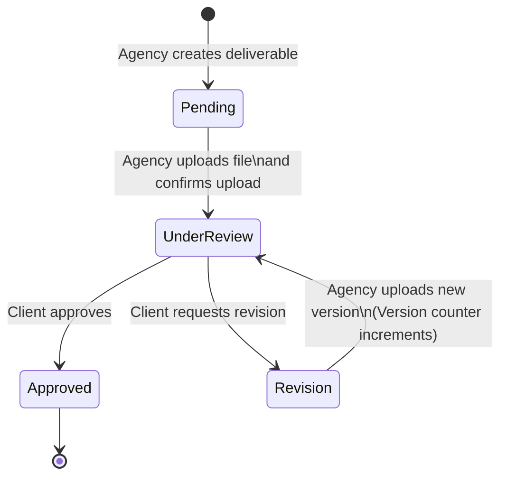
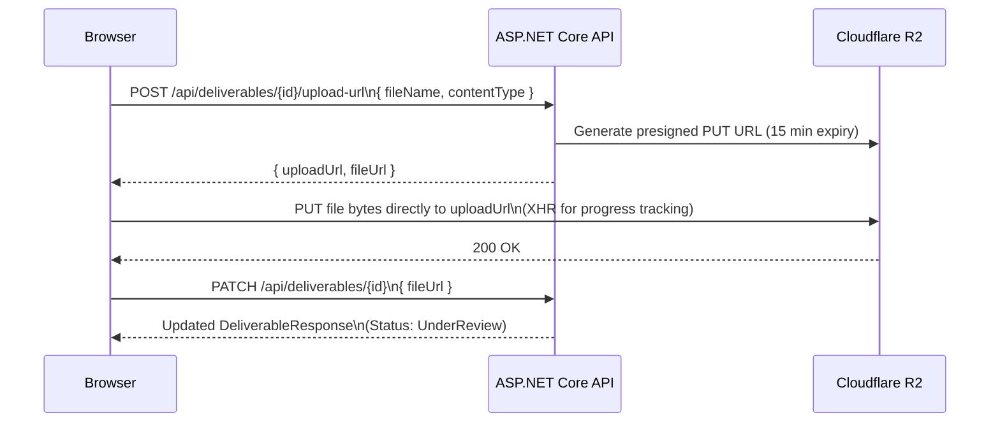
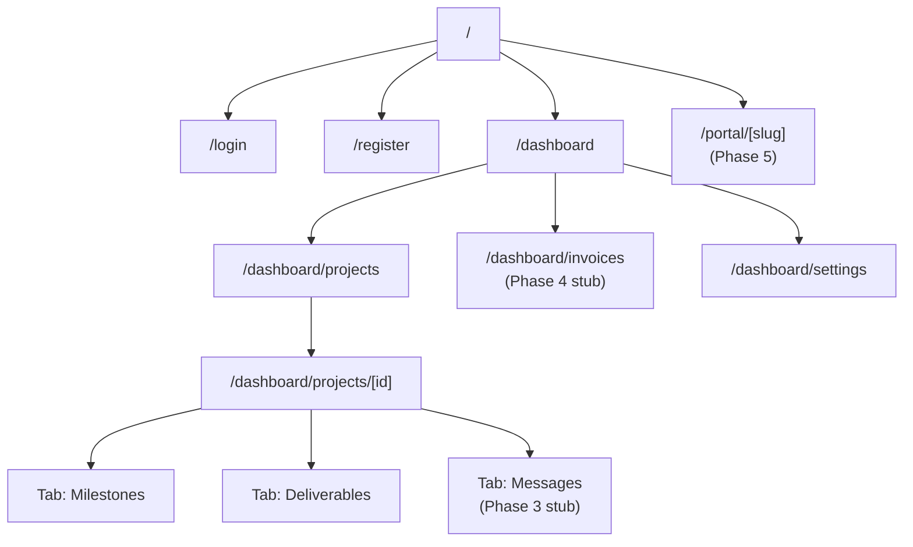
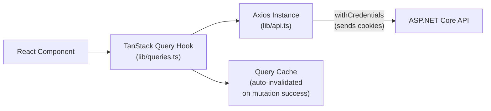
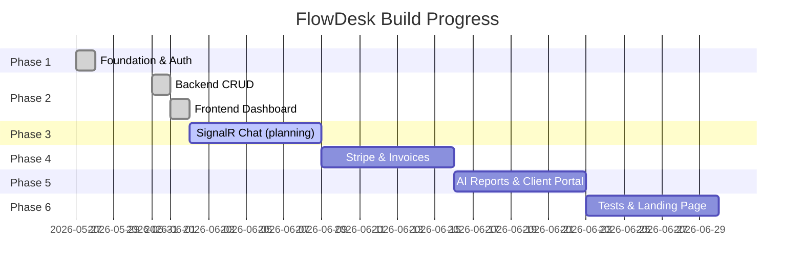

# FlowDesk — Development Summary

> A record of what has been built, how it works, and where it is going.
> Last updated: 2026-06-02

---

## What Is FlowDesk?

FlowDesk is a **white-labeled client portal SaaS** for agencies and consulting firms. Every agency gets a branded online space where their clients can track project progress, approve deliverables, pay invoices, and message the team in real time.

**Target customers:** Design agencies, dev agencies, marketing agencies, freelance consultants — any service business with 2–20 active clients at a time.

---

## System Architecture

Two services deployed independently:



**Key architectural decision:** File bytes (deliverable uploads) go directly from the browser to Cloudflare R2 via a presigned URL. The API server never touches file content — it only generates the upload URL and later stores the resulting public file URL.

---

## Backend Project Structure



**Rule:** `Core` has zero infrastructure dependencies. `Infrastructure` references only `Core`. `API` is the composition root — all dependency injection registration lives in `Program.cs`.

---

## Database Schema



**Multi-tenancy:** Every entity with `OrganisationId` has a global EF Core query filter applied in `AppDbContext`. Queries are automatically scoped to the authenticated user's organisation — cross-tenant data leaks are structurally prevented.

---

## Authentication Flow



**Security design:** Tokens are stored in `httpOnly` cookies — never in `localStorage` or accessible to JavaScript. The Axios instance in `lib/api.ts` has an interceptor that silently retries on 401 via the refresh endpoint.

---

## JWT Claims

| Claim | Value | Used for |
|---|---|---|
| `sub` | UserId (GUID) | Identity |
| `email` | User email | Display |
| `role` | AgencyOwner / AgencyMember / Client | Authorization policies |
| `org` | OrganisationId (GUID) | Multi-tenant EF query filter |
| `name` | Display name | UI greeting |

---

## Deliverable Workflow (State Machine)



When a revision is requested, the deliverable's `Version` counter increments and `RevisionNotes` are stored. The agency re-uploads, moving the deliverable back to `UnderReview` for the client to review again.

---

## File Upload Flow (Deliverables)



---

## Frontend Route Structure



**Route guard:** `src/proxy.ts` (Next.js 16's renamed middleware) checks for the `access_token` cookie. Unauthenticated users are redirected to `/login`. Authenticated users visiting `/login` or `/register` are redirected to `/dashboard`.

---

## Frontend Data Layer

All server state lives in `src/lib/queries.ts` as TanStack Query hooks. Components never call `api.ts` directly.



---

## What Was Built — Phase by Phase

### Phase 1 ✅ — Foundation (2026-05-27)

**Goal:** Working backend that can register and authenticate agency accounts, deployed to production.

| What | Detail |
|---|---|
| Clean architecture scaffold | Core → Infrastructure → API dependency graph |
| EF Core multi-tenant schema | All 9 entities with global query filters |
| JWT authentication | Access token (15 min) + refresh token (7 days) with rotation |
| Role-based authorization | AgencyOnly, AgencyOwnerOnly, ClientOnly policies |
| Global exception middleware | All errors → ProblemDetails RFC 7807 |
| FluentValidation | All request DTOs validated before hitting services |
| Scalar API docs | Available at `/scalar` in development |
| Railway deployment | Nixpacks auto-detect, `dotnet FlowDesk.API.dll` start command |
| Neon PostgreSQL | Serverless Postgres in production, Docker locally |

**Auth endpoints built:** `POST /register`, `POST /login`, `POST /refresh`, `POST /logout`, `POST /invite`

---

### Phase 2 ✅ — Core CRUD + Dashboard (2026-05-31 → 2026-06-01)

**Goal:** Agencies can create projects, track milestones, upload deliverables for client approval, and manage their settings — all from a working Next.js dashboard.

#### Backend

| What | Detail |
|---|---|
| Projects CRUD | Full controller → service → repository stack |
| Milestones CRUD | Ordered by `Order` field; status cycling |
| Deliverables CRUD | Includes presigned R2 upload URL flow |
| Deliverable approval workflow | Full state machine (see diagram above) |
| Progress calculation | `GET /api/projects/{id}/stats` — milestone completion % |
| Organisation settings | GET + PUT `/api/organisations/me` |
| Users endpoint | `GET /api/users?role=Client` for client picker |
| Cloudflare R2 integration | `FileStorageService` using AWS S3 SDK |

#### Frontend

| What | Detail |
|---|---|
| Project list page | Grid of cards with status badges, skeleton loading |
| Create Project dialog | Form with name, description, client picker; Zod validation |
| Project detail page | `use(params)` for Next.js 16 Promise params |
| Milestones tab | CRUD inline form; status cycling (agency only) |
| Deliverables tab | File upload with XHR progress bar; approve/revision workflow |
| Dashboard home | Live stats from API (active projects, active clients) |
| Settings page | Editable agency name + brand color (color picker); Save/Cancel with dirty state |
| TanStack Query layer | All hooks in `lib/queries.ts`; mutations invalidate relevant caches |

---

## Current State (2026-06-02)



---

## What Is NOT Built Yet

| Feature | Phase |
|---|---|
| Real-time chat (SignalR ChatHub) | 3 |
| Live status push (SignalR ProjectHub) | 3 |
| Message file attachments | 3 |
| Invoice CRUD | 4 |
| Stripe Connect payments | 4 |
| SendGrid email reminders | 4 |
| AI streaming reports (Gemini) | 5 |
| Custom domain per agency | 5 |
| Client portal (`/portal/[slug]`) | 5 |
| xUnit test suite | 6 |
| Landing page | 6 |

---

## Key Decisions Made

| Decision | Reason |
|---|---|
| JWT in httpOnly cookies (not headers/localStorage) | XSS-safe; SameSite=Strict prevents CSRF |
| Refresh token rotation on every use | Detect token theft — a reused refresh token revokes the entire chain |
| EF global query filters for multi-tenancy | Prevents cross-org data leaks at the ORM layer, not the application layer |
| Files go direct to R2 (not through API) | API server never handles binary payloads; scales better |
| `proxy.ts` not `middleware.ts` | Next.js 16 renamed Middleware to Proxy |
| Route `params` unwrapped with `use(params)` | Next.js 16 made params a Promise |
| All TanStack Query hooks in `lib/queries.ts` | Single source of truth for server state; easy to find and modify |
| Scalar instead of Swagger UI | Cleaner DX, same OpenAPI spec underneath |
| Railway + Nixpacks (no Dockerfile) | Zero-config .NET deployment |

---

## Environment Variables Quick Reference

### API (`.env` at repo root)
```
DATABASE_URL         # Neon connection string (prod) or Docker (dev)
JWT_SECRET           # Random 64-byte base64 string
FRONTEND_URL         # http://localhost:3000 (dev) or Vercel URL (prod)
CLOUDFLARE_R2_ACCESS_KEY
CLOUDFLARE_R2_SECRET_KEY
CLOUDFLARE_R2_BUCKET
CLOUDFLARE_R2_ENDPOINT       # https://<accountid>.r2.cloudflarestorage.com
CLOUDFLARE_R2_PUBLIC_URL     # Public file domain (e.g. https://files.yourdomain.com)
```

### Frontend (`flowdesk-web/.env.local`)
```
NEXT_PUBLIC_API_URL           # http://localhost:5269 (dev)
NEXT_PUBLIC_SIGNALR_URL       # (Phase 3)
NEXT_PUBLIC_STRIPE_PUBLISHABLE_KEY  # (Phase 4)
```
